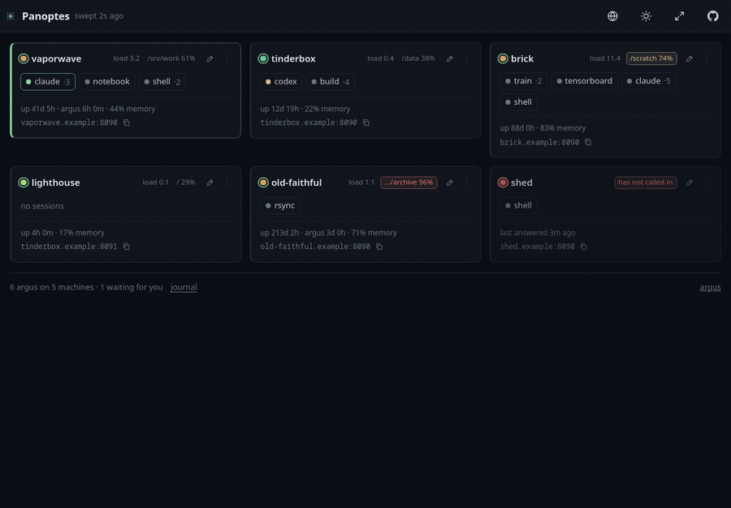

<div align="center">


# Panoptes

**One page for every machine you run agents on: which are up, what is running on them, and
which one is waiting for you.**



*Six machines, one screen. `vaporwave` is asking you something, so it is at the top.
`old-faithful` is at 96% on `/var/lib/archive`, `shed` has stopped calling in — and halfway
through, an agent on `brick` stops and asks: nobody was watching `brick`, and it comes to the
top on its own. Clicking a session name opens that terminal, on that machine. Every machine
in it is invented by `scripts/demo.py`.*

[](https://github.com/andreaderuvo/panoptes/actions/workflows/tests.yml)
[](https://github.com/andreaderuvo/panoptes/actions/workflows/install.yml)
[](https://www.python.org/)
[](#)
[](LICENSE)
[](https://github.com/andreaderuvo/panoptes/wiki/Getting-started)
[](https://github.com/andreaderuvo/argus)

**[See it in one page →](https://andreaderuvo.github.io/panoptes/)**  ·  **[Read the
wiki →](https://github.com/andreaderuvo/panoptes/wiki)**

</div>

## Run it

```bash
curl -fsSL https://raw.githubusercontent.com/andreaderuvo/panoptes/master/install.sh | bash
panoptes                       # prints a URL with a token in it; --qr prints a code too
```

No `sudo`, nothing outside your home; the same line again updates it. Or `docker compose up
-d` — a board is the one of the two that belongs in a container, since it has no tmux, no
filesystem and no terminal — or `git clone` and `pip install -r requirements.txt`. [All
three](https://github.com/andreaderuvo/panoptes/wiki/Getting-started).

Python 3.11+, four dependencies, no build step, no database. Runs anywhere Python does,
Windows included. The first run writes
`~/.config/panoptes/config.yaml` with a fresh token; add your machines to it and restart.
With none listed the board says so and shows you what it would look like, so you can see
the thing before wiring anything up.

Then tell it about your machines, or tell your machines about it — [both directions
work](https://github.com/andreaderuvo/panoptes/wiki/Machines-on-the-board), and which one
you want depends on which way through your network is open.

> [!NOTE]
> **Early, and moving.** Panoptes is days old and in daily use by one person. The tests run on
> every push, and so does the churn: **config keys and API shapes can change between commits**,
> and a version number is a marker rather than a contract until 1.0. Nothing here owns anything
> — losing this board loses a list of session names — so the risk is inconvenience rather than
> damage.
>
> **Feedback is the most useful thing you can send**, especially "this broke" or "I expected X".
> [Open an issue](https://github.com/andreaderuvo/panoptes/issues) with what you did, what
> happened, and which OS.

> [!IMPORTANT]
> **Panoptes cannot get into anything.** It holds one read-only key per machine, never
> sends one to a browser, and has no shell, no filesystem and no terminal of its own.
> Clicking through to a machine opens that machine's Argus, in its own origin, with its own
> token. Losing this board loses a list of session names.

## Where everything else is

| | |
|---|---|
| [Getting started](https://github.com/andreaderuvo/panoptes/wiki/Getting-started) | the config file, the flags, running it as a service |
| [Machines on the board](https://github.com/andreaderuvo/panoptes/wiki/Machines-on-the-board) | what a tile says, and the two ways a machine gets on it |
| [Starting and stopping](https://github.com/andreaderuvo/panoptes/wiki/Starting-and-stopping) | naming what a board may run, and turning an Argus off |
| [Colours, tints and notes](https://github.com/andreaderuvo/panoptes/wiki/Colours-tints-and-notes) | telling six tiles apart at a glance |
| [The journal](https://github.com/andreaderuvo/panoptes/wiki/The-journal) | the three things that happen only on a board |
| [Security](https://github.com/andreaderuvo/panoptes/wiki/Security) | what it holds, and what it does not protect you from |
| [Reaching it from outside](https://github.com/andreaderuvo/panoptes/wiki/Reaching-it-from-outside) | Tailscale, a tunnel, a certificate |
| [The API](https://github.com/andreaderuvo/panoptes/wiki/The-API) · [Translating it](https://github.com/andreaderuvo/panoptes/wiki/Translating-it) · [Development](https://github.com/andreaderuvo/panoptes/wiki/Development) | |

<div align="center"><sub><i>Argus Panoptes — "the all-seeing" — had a hundred eyes, and some
of them were always open.</i></sub></div>

## Licence

MIT — see [LICENSE](LICENSE).

---

<div align="center">

**Panoptes** is the board. **[Argus](https://github.com/andreaderuvo/argus)** is what a tile
links to: the tmux sessions on that machine, its files and its documents, in a browser.
Neither needs the other to be useful.

</div>
