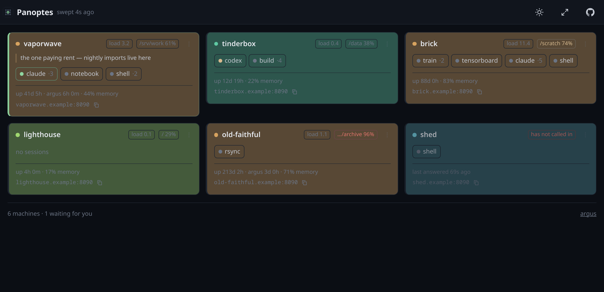
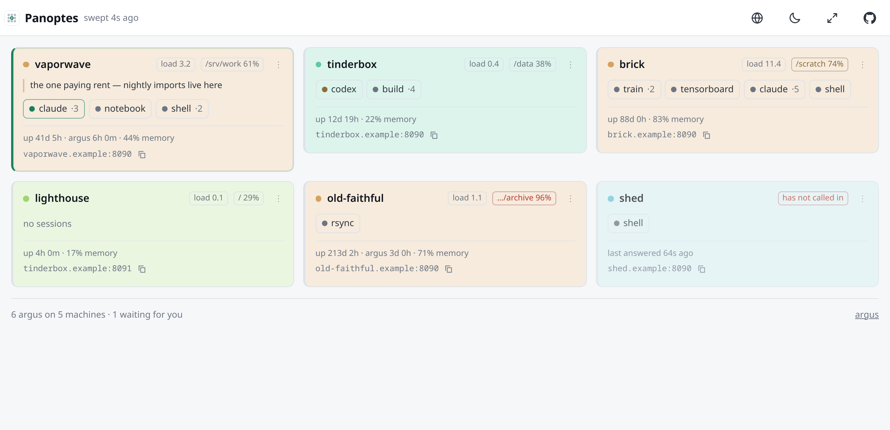
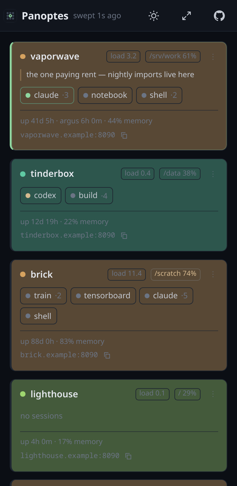

<div align="center">


# Panoptes

**One page for every machine you run agents on: which are up, what is running on them, and
which one is waiting for you.**



*Six machines, one screen. `vaporwave` is the one asking you something — it is at the top
and it is the only tile wearing the accent. `old-faithful` is at 96% on `/var/lib/archive`.
`shed` has stopped calling in. Clicking a session name opens that terminal, on that machine.*

[](https://www.python.org/)
[](LICENSE)
[](#running-it)
[](https://github.com/andreaderuvo/argus)

</div>

## What it is for

[Argus](https://github.com/andreaderuvo/argus) puts a browser onto the tmux sessions on one
machine. The moment there are three machines, the question changes: not *what is this box
doing* but **which box needs me**.

Answering that by opening three tabs does not work, because the whole point is that you are
not looking. You want one page that is worth glancing at, that tells you the one thing you
cannot work out from anywhere else — an agent has stopped and is waiting for an answer — and
that gets you to the right terminal in one click when it does.

```bash
pip install -r requirements.txt
python3 -m app.main            # prints a URL with a token in it
python3 -m app.main --qr      # and a code to photograph
```

That is the board. Then tell it about your machines, or tell your machines about it — both
directions work, and [which one you want depends on your network](#how-a-machine-gets-onto-the-board).

> [!IMPORTANT]
> **Panoptes cannot get into anything.** It holds one read-only key per machine, never sends
> one to a browser, and has no shell, no filesystem and no terminal of its own. Clicking
> through to a machine opens that machine's Argus, in its own origin, with its own token.
> Losing this board loses a list of session names.

<div align="center"><sub><i>Argus Panoptes — "the all-seeing" — had a hundred eyes, and some
of them were always open.</i></sub></div>

## What a tile says

Everything on a tile is one glance's worth, ordered by how likely it is to be the reason you
looked:

| | |
|---|---|
| **Which one wants you** | The accent bar down the left edge, and that machine sorts to the top. It is the only thing that gets that bar — a machine's own colour never touches it. |
| **Sessions** | One chip each, with the window count. Green means it is asking you something; amber means it finished. Click one and you are in that terminal. |
| **Load, and the fullest disk** | Amber over 74%, red over 90%. Only the disk in the most trouble: a board wants to know there is a problem, not to inventory the filesystems. |
| **Two uptimes** | The machine's, and how long *this Argus* has been running. Three Argus instances on one box report the same machine uptime; the second number is the one that tells them apart. |
| **Its address, and a button to copy it** | Because the useful thing is often not "open it here" but the address itself, to paste into a terminal or send to somebody. |
| **A line of your own** | A note you write, kept per machine: what the box is for, what it was doing, why it looks like that. Everything else on the tile, the machine said. This is the part only you know. |

The footer counts what is actually there — `4 argus on 2 machines`, when three of them are on
one box.

<p align="center">
  
  
</p>

## How a machine gets onto the board

Two directions, and the network decides which one you can have.

### The board asks (pull)

Write the machine down and the board polls it. This is the better arrangement wherever it
works: a request that fails **is** the signal that a machine is down, and there is one file
that says what is being watched.

```yaml
# ~/.config/panoptes/config.yaml
listen: 0.0.0.0:8070
token: <the board's own token, generated on first run>

machines:
  - name: hetzner
    url: http://hetzner.internal:8090
    token: <a watcher token from that machine's Argus>
    # Where a *browser* should go, when that is not where this board asks.
    reach: http://hetzner.example.com:8090
    colour: 4                     # optional; otherwise from the name
    note: the one paying rent     # optional; a reader can write over it
```

On the Argus side, a **watcher** token is a key that opens `GET /api/overview` and nothing
else — no shell, no files, no writes, no proxy:

```yaml
# ~/.config/argus/config.yaml, on each machine
watchers:
  - name: panoptes
    token: <16+ characters, not the same as the main token>
```

### The machine calls in (push)

Some networks only go one way. Measured on the pair this was written for: two boxes on the
same wire, same /25, each with the other's MAC in its ARP table, and one of them refusing
everything inbound. A board on the reachable side will never poll the other, and no amount
of configuration on the board changes that.

So the machine opens the connection instead, in the direction that already works:

```yaml
# panoptes config: allow it
registration_token: <16+ characters, different from the board's token>
forget_after: 45          # seconds of silence before it stops being believed
```

```yaml
# argus config, on the machine that cannot be reached
report_to:
  url: http://board.internal:8070
  token: <the registration token>
  name: gpu2                        # what you want it called on the board
  reach: http://gpu2.internal:8090  # where a browser should go
  every: 10
```

What it sends is what `GET /api/overview` returns and nothing else: hostname, uptime, load,
memory, the fullest disk, and the session names with which of them is ringing. No file, no
path, no token, no command. Off unless configured.

This is not a workaround anybody invented here — it is what Prometheus does in agent mode,
and what every dial-out agent does: Tailscale, Cloudflare Tunnel, Teleport, the kubelet
registering with its API server. **Local pull, remote push.**

Three rules keep it honest:

- **Announcing and looking are different keys.** The registration token cannot read the
  board; the board's token cannot invent machines.
- **The list you wrote by hand wins.** A machine announcing a name you have configured is
  refused, so nothing holding the registration key can quietly replace a real machine with
  one of its own.
- **Silence is the only signal there is.** No request fails when nobody is asking, so a
  machine that stops calling in goes cold after `forget_after` rather than staying green
  for ever.

## Starting and stopping

The ⋯ on a tile can start and stop things on that machine, and stop its Argus — but only
what that machine has agreed to, and the board neither knows nor invents the list.

**No command ever arrives in a request.** That is the whole design, and it is what keeps the
weak keys weak: each machine publishes named things in its own config, and the board may ask
for one of those names and nothing else.

```yaml
# argus config, on the machine
runnable:
  - name: nightly
    run: python3 nightly.py
    cwd: /srv/work

watchers:
  - name: panoptes
    token: …
    may_run: true             # otherwise the token stays read-only
    may_stop_argus: false     # the one thing this board cannot undo
```

An ordinary board shows nothing in that section, which is correct: pressing these has to be
granted on the machine, not assumed by the page. **Stopping an Argus is the power icon on the
tile itself**, and it appears only where that machine allows it — there is no greyed placeholder
where it does not, so if you cannot see it, the line above is the one to add.

**Stopping an Argus asks twice**, and says what it costs: every tmux session keeps running —
Argus only watches them — but nothing here can start it again. That takes a shell on that
machine, or whatever supervises it there. It is the only one-way action on the board.

**For a machine this board cannot reach**, there is no connection to open, so the instruction
waits and travels back in the reply to that machine's own next announcement. The board says
`queued` rather than showing a tick it has not earned. On the machine:

```yaml
obey_board: true              # off by default: announcing is not agreeing to take orders
board_may_stop_argus: false
```

Handed over once. If it does not happen, press the button again — better than a board that
keeps insisting at a machine which has already refused.

## Colours, tints and notes

A machine's colour comes from its name, hashed into Argus's palette — no configuration, and
the same colour on every device you open the board from. That is a good default and a bad
only-option: on a four-machine board here, two names landed on the same step.

So there are three answers, most personal first:

1. **A colour you picked**, in this browser — the ⋯ on any tile.
2. **A colour in the config**, the same for everyone who opens the board.
3. **The hash of the name**, which is what an unconfigured board shows.

The same ⋯ sets how strongly that colour tints the tile — five steps, kept as a multiplier so
it means the same thing in both themes.

**The note is the pencil, on the tile.** Not in that sheet: changing how a machine looks and
writing down what it is for are different errands, and the second is the one you do in a hurry.
It saves as you type, in the place the note will appear, and the board stops refreshing while
you write — otherwise a sweep four seconds later would take the box away with the cursor still
in it.

## The API

Everything the page does, it does over HTTP, and the description is generated from the routes
themselves: [`docs/openapi.json`](docs/openapi.json). A test fails if it drifts, so it cannot
quietly start describing a board that does not exist.

| | |
|---|---|
| `GET /api/board` | every machine, as of the last sweep — and never a machine's token |
| `POST /api/report` | a machine announcing itself; answers with anything queued for it |
| `POST /api/do/{machine}/{what}/{action}` | start or stop something, or `argus` itself |
| `DELETE /api/machines/{name}` | take an announced machine off the board for good |
| `GET /api/journal` | what was done here, and what was refused |
| `GET /api/languages`, `GET /api/language/{code}` | the catalogues |
| `GET /api/health` | is the board itself up |

## Translating it

Four languages ship with the board — English, Italian, French, Spanish — and the globe in the
header switches between them. Whatever your browser asks for is the default.

Adding a fifth is **one flat JSON file whose keys are the English strings**. No gettext, no
`.po`, no extraction step, no build, and nothing to register:

```json
{
  "code": "de",
  "name": "Deutsch",
  "strings": {
    "no sessions": "keine Sitzungen",
    "up {age}": "läuft seit {age}",
    "{n} machines": "{n} Maschinen"
  }
}
```

Drop it at `~/.config/panoptes/lang/de.json` — beside the config file — and it appears in the
picker. Nothing to restart on the browser's side.

- **A missing entry falls back to English**, so a translation is useful the day it is
  started. There is no broken half.
- **`{n}`, `{age}`, `{path}` and friends must survive into the translation.** They are filled
  in at the point of use; one that is dropped leaves a hole in the sentence.
- **A file you drop in overrides one that ships**, which is how a wording you disagree with
  gets fixed without a fork.

Copy `static/lang/en.json` to see every key — it lists all of them. To send one back, open a
pull request with the file in `static/lang/`; a test checks that every catalogue covers every
string and keeps its placeholders, so a stale one cannot pass unnoticed.

[Argus](https://github.com/andreaderuvo/argus#translating-it) works the same way, file for
file — and it can also import a catalogue from its Settings screen, which is the version of
this that works from a phone.

## The journal

`journal`, in the footer. Three things happen only here, and nothing else would ever see them:

- **Who pressed stop.** The board sends the instruction and the machine records that
  "panoptes" did it — true from where the machine stands, and not enough. The board is the only
  thing that knows which browser the click came from.
- **Who tried to get into the board.** This page lists every machine you own, what is running
  on each and how full its disks are. A run of 401s against that deserves seeing as much as one
  against a machine.
- **Who invented a machine.** The registration token is the weakest key here; anything holding
  it can announce a machine that does not exist. It cannot overwrite one you configured — that
  is refused — and now the refusal is written down.

A machine calling in every few seconds is the board's heartbeat, not an event, so it is not
recorded; a *refused* announcement is. Refusals from one address are collapsed with the count
kept, because a board that rotates its own history away while being knocked on is worse than
none. Filters for *Everything*, *Refused* and *Changes*, and a box matching the address, the key
and the action at once.

Unlike [Argus](https://github.com/andreaderuvo/argus#the-journal), whoever can read the board
can read this: there are no per-device tokens here, so there is no weaker key to keep it from.

## What it is not

- **Not a way in.** There is no terminal, no file browser and no command here. If you want
  those, that is [Argus](https://github.com/andreaderuvo/argus), on the machine itself.
- **Not a monitoring system.** No history, no graphs, no alert rules, nothing on disk. It
  says what is true now. If you need a year of metrics you want Prometheus, and the two are
  not in competition — this one exists to be glanced at.
- **Not a scheduler.** It starts nothing, stops nothing, and has no opinion about what
  should be running.
- **Not multi-user.** One token, one board, one person's machines.

## Running it

Python 3.11 or newer, three dependencies, no build step, no database.

```bash
git clone https://github.com/andreaderuvo/panoptes
cd panoptes
pip install -r requirements.txt
python3 -m app.main
```

The first run writes `~/.config/panoptes/config.yaml` with a fresh random token, at mode
600, and prints the URL to open. Add your machines to it and restart.

```
  panoptes 0.0.1 · 3 machine(s) · accepts announcements

  open    http://127.0.0.1:8070/?token=…
          (panoptes --qr prints a code to photograph)
```

Useful flags:

| | |
|---|---|
| `--config PATH` | somewhere other than the default |
| `--listen HOST:PORT` | default `127.0.0.1:8070` |
| `--qr` | print the URL as a QR code too, one per address it answers on |
| `--listen HOST:PORT` | override the config for this run — usually because a port is taken |

To keep it running, a user unit is enough — and `loginctl enable-linger` so it survives your
logging out:

```ini
# ~/.config/systemd/user/panoptes.service
[Unit]
Description=Panoptes
[Service]
ExecStart=/usr/bin/python3 -m app.main
WorkingDirectory=%h/panoptes
Restart=on-failure
[Install]
WantedBy=default.target
```

```bash
systemctl --user enable --now panoptes
sudo loginctl enable-linger "$USER"
```

### Seeing it without any machines

There is a demo board that invents six of them, so you can look at the thing before wiring
anything up. It is also where every picture in this README comes from — a screenshot of a
real board publishes hostnames, ports and session names, and a made-up one stays identical
between releases, so a retaken picture shows the change and nothing else.

```bash
python3 scripts/demo.py        # a board on 127.0.0.1:8770, six machines that do not exist
```

## Security

The design is one idea: **the board is not a way in.**

- **It never sends a machine's token to a browser.** The page is told where a machine is,
  never how to get into it. There is a test whose only job is to fail if that ever changes.
- **The keys it holds are weak on purpose.** A watcher token opens one read-only endpoint on
  one machine. Losing the board's config loses a list of session names.
- **Its own token is compared in constant time**, and it is taken out of the address bar on
  arrival so it is not left in the history of every phone that has opened the board.
- **`Referrer-Policy: no-referrer`**, so clicking through to a machine does not tell it where
  you came from.
- **Two keys, two doors.** Announcing cannot read; reading cannot announce.
- **It refuses to start** with an empty or short token, with a watcher token that equals the
  main one, or with a registration token that equals the board's.

### What it does not protect you from

- **It is plain HTTP by default.** Anyone on the path sees the board's token go past once, in
  the address, and everything after it.
- **It publishes your estate.** Not a way in, but a list of every machine you run, what is on
  each, and how full its disks are. That is reconnaissance, handed over.
- **`may_run` widens it.** With that flag on a watcher, whoever holds the board's config can
  start and stop the things you listed, and stop those Argus servers if you allowed it. Still
  not a shell — the key gets 403 on files, sessions, ports and everything else — but it is no
  longer read-only.

## Reaching it from outside

The board is safer to expose than an Argus, because there is no shell behind it. It is still
not something to put on the open internet, and there is a second reason that catches people
out: **the links on the tiles have to work from wherever you are reading the board.** A tile
sends you to `reach:`, and if that is a LAN address then a board reached over the internet is
a board full of dead links. Fixing the board's own reachability without fixing the machines'
gets you one page and no way through it.

Which is why a VPN is the right shape here rather than a public URL — it makes the board and
every machine on it reachable by the same names, from anywhere.

### HTTPS, if you have a certificate

Both take the same two keys, and neither requires them:

```yaml
tls_cert: /path/to/fullchain.pem
tls_key:  /path/to/privkey.pem
```

The printed link and the QR code change to `https://` with them, so what you scan matches
what the port speaks. One without the other is refused at startup — it would serve plain HTTP
while looking configured, which is the worst of the three states.

**It is never required, on purpose.** On a LAN the address is a hostname or a private IP, and
no public CA will sign either; so "just use HTTPS" means a self-signed certificate the browser
argues about on every device, or your own CA installed on each of them, or a public DNS name
pointing at a machine that has none. That turns a thirty-second setup into a certificate
project, and the people who most need this are the ones who would give up.

What you give up without it is real and worth knowing: no installable PWA, no browser
notifications, no in-app camera, and the clipboard falls back to an older API. What you mostly
do *not* give up is confidentiality, if you are already behind a VPN — the traffic is
encrypted on the wire either way. The exception is the token, which travels in the address
once; on a shared LAN segment that is the thing worth encrypting.

**Tailscale** — the one to pick, and the one this pairs with best:

```bash
# on the machine running the board
tailscale serve --bg 8070          # https://<board>.<tailnet>.ts.net → your board
```

Then in the config, give each machine its **MagicDNS name** as `reach`, so a tile sends you
somewhere that resolves from your phone as well as from the board:

```yaml
machines:
  - name: hetzner
    url: http://127.0.0.1:8090            # where this board asks, over loopback
    reach: https://hetzner.tailnet.ts.net # where a browser should go, from anywhere
    token: …
```

`serve` puts a real certificate in front — a genuine one, for a `*.ts.net` name, with nothing
to install on any device — which is also what makes the board **installable as an app** and
unlocks the clipboard API.

If you would rather not: Chrome will treat a plain-http origin as secure if you list it in
`chrome://flags/#unsafely-treat-insecure-origin-as-secure`, and then it offers the install
too. That is a per-browser decision you make deliberately, which is the right shape for it.

The service worker behind that is **network first, always**. The cache is a fallback and
nothing else — the board opens instantly instead of waiting for a LAN round trip, and it
never answers for `/api`, because the entire content of this page is which machine wants you
*now* and a stale answer to that is worse than none. Nothing is exposed to the internet: only devices on your tailnet can reach
it. **`tailscale funnel` does expose it publicly — don't.** Not for the board, and certainly
not for an Argus, which is a shell.

**An SSH tunnel** — nothing to install anywhere, and enough for one sitting:

```bash
ssh -N -L 8070:127.0.0.1:8070 you@board
# then open http://127.0.0.1:8070
```

The tiles' links will point at addresses your laptop cannot resolve unless you forward those
too, one `-L` per machine. Fine for a look, tiring as a habit.

**WireGuard, Cloudflare Tunnel, Teleport** — all work, and none of them needs anything from
Panoptes. That is deliberate: `report_to` exists precisely to abstract "the network only goes
one way", and it covers all of them the same. There is no Tailscale integration in the code
and there should not be — it would make one product the privileged path for a problem that is
already solved neutrally.

**A public reverse proxy**, if you insist: terminate TLS, require your own authentication in
front (the board's token is not enough on the open internet), and accept that you now need a
public hostname per Argus for the links to work — which multiplies the exposure by the number
of machines you own. Argus's [own notes on this](https://github.com/andreaderuvo/argus#reaching-it-from-outside)
apply, more so.

## Development

```bash
pip install -r requirements.txt
python -m pytest -q
```

No build step and no bundler: the frontend is three files in `static/`, served as they are.

## Licence

MIT — see [LICENSE](LICENSE).

---

<div align="center">

**[Argus](https://github.com/andreaderuvo/argus)** — the same idea for one machine: tmux
sessions, files and documents in a browser.
**Panoptes** is what you open when there are several.

</div>
